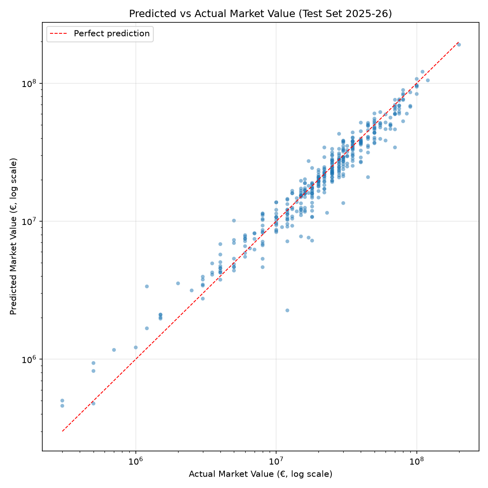
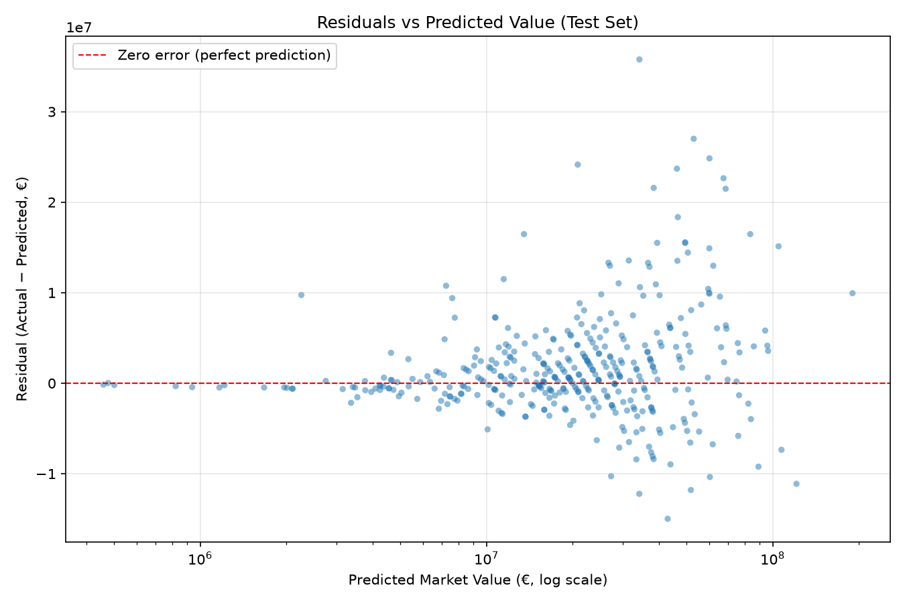
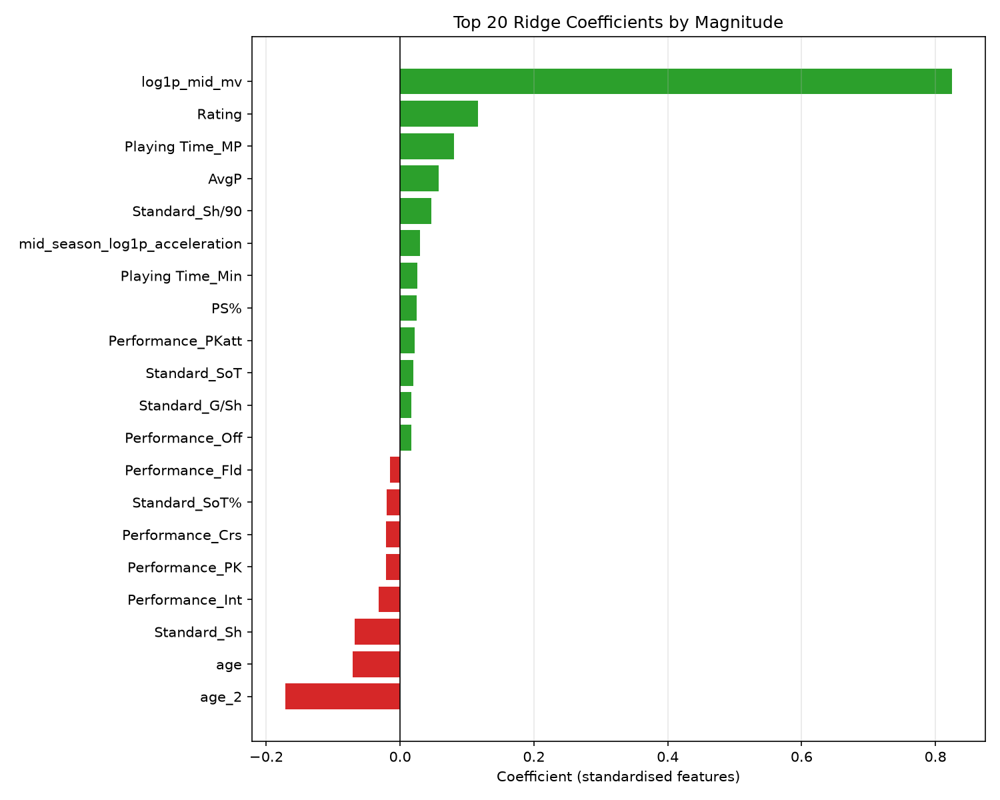
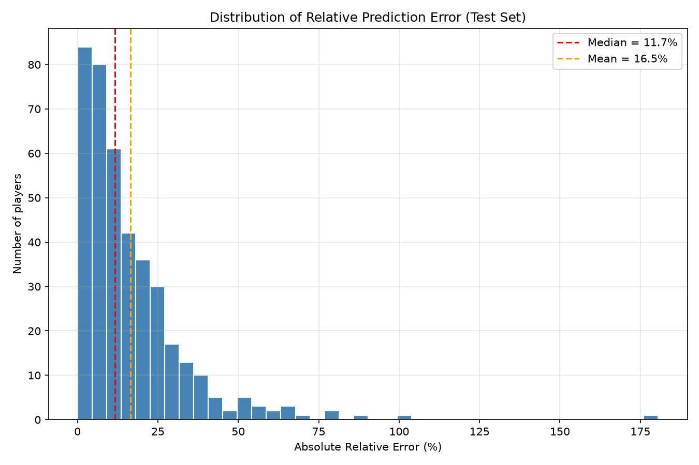

# Premier League Market Value Predictor

Predicting end-of-season Transfermarkt market values for Premier League outfield players from their season-wise performance statistics and value momentum, trained on five seasons *(2021–22 to 2025–26)*.

## Contents
- [Overview](#overview)
- [Key Findings](#key-findings)
- [Visualizations](#visualizations)
- [Data and Methodology](#data-and-methodology)
- [Reproducibility](#reproducibility)
- [Limitations](#limitations)
- [Interpretation: Three Extreme Cases](#interpretation-three-extreme-cases)
- [Future Work](#future-work)
- [Conclusion](#conclusion)
- [References](#references)
- [Disclaimer](#disclaimer)
- [Appendix](#appendix)

## Overview

Transfermarkt market values are community-driven estimates of a player's medium-term worth, not transfer fees nor the output of any published algorithm.
They explicitly state that values are determined through community discussion informed by a documented set of factors: age, future prospects, performance at club and international level, reputation, marketing value, injury history, and broader market trends *(more on [Transfermarkt](https://www.transfermarkt.com/navigation/mwdefinition))*. 
Values update roughly twice per season, in December and after the season ends, and influence transfer negotiations, contract discussions, and media narratives.

This project asks a narrower question: how much of the variation in end-of-season market value can be explained by season-wise performance statistics and prior value momentum alone? 
Many of the factors Transfermarkt lists, such as reputation, injury susceptibility, interested clubs, and situational conditions, are not observable from public data. 
The model includes what is observable: appearance, shooting, passing, defensive and various miscellaneous stats, plus the player's own value trajectory. 
It is trained on five seasons *(2021–22 to 2025–26)* using scraped FBref and WhoScored data, and Kaggle Transfermarkt data by [David Cariboo](https://www.kaggle.com/datasets/davidcariboo/player-scores), with a season-based train/validation/test split and a Ridge regression baseline.

On the held-out 2025–26 season, the model achieves **R² = 0.942** with a median relative error of 11.7%, a 22.82% RMSE improvement over the strongest naive baseline (predict = mid‑season value). 
The results also reveal a structural bias worth naming. 
The model underpredicts the top of the market. 
All 15 of the worst test errors are underpredictions, concentrated in the 2025-26 season. 
It also overpredicts youth. The 15 largest upward gaps are all aged 25 or under, with a median age of 22.
Errors on very young players (under 21) are also larger and less reliable than on established players.
These biases are consistent with what the model cannot see, namely the reputation, development potential, and transfer-context factors that Transfermarkt's community considers but performance statistics do not capture.

## Key Findings

### 1. Prior market value is the single strongest predictor

The two momentum features carry more coefficient weight than all 41  performance statistics combined. 
The signal is now almost entirely `log1p_mid_mv` *(+0.824)*. `log1p_pre_mv` has collapsed to +0.014 because the mid-season checkpoint already reflects everything the pre-season value knew.
Market value is highly autocorrelated, and therefore the best predictor of a player's value in June is their value in December, which in turn reflects their value the previous June.
As such, any model that ignores prior value will lose most of its signal. The interesting question is not *"can we predict market value?"* but *"how much can performance stats add beyond momentum?"*, and the answer is a 22.82% RMSE improvement.

### 2. Age effect is subtler than it appears

At first glance, the coefficients for `age` *(−0.071)* and `age²` *(−0.172)* seem to contradict the inverted-U relationship between age and market value, which peaks at 22 to 27 (more on [Transfermarkt](https://www.transfermarkt.com/-euro-6-98-billion-tops-list-which-age-has-the-highest-collection-of-valuable-players-/view/news/457939)). 
The contradiction has a clean explanation: `log1p_mid_mv` already encodes the market's full current assessment, **including the age premium**, the age terms capture only the **residual** effect **conditional on current value**, 
i.e., given two players with identical current value, the older player depreciates more, and the depreciation accelerates sharply past a threshold age.

### 3. The market penalises attempt volume over completed actions

Four of the largest negative coefficients (after age) belong to **attempt** actions, recorded regardless of outcome: 
`Standard_Sh` _(−0.068)_,`Performance_Int` *(−0.032)*, `Performance_Crs` *(−0.021)*, and `LongB` *(−0.011)*.
By contrast, stats only recorded on success are positive: `AvgP` *(+0.057)*, `KeyP` *(+0.009)*, `Performance_TklW` *(+0.008)*. 
For crosses specifically, this aligns with Vecer (2018), who found that open crosses convert at roughly 1.1%, which is about half the rate of a final-third entry.
So, crosses were estimated to have a statistically significant negative effect on team-level goal production.
The mechanism Vecer (2018) proposes generalises that **attempt actions with poor conversion displace better options**, and the market appears to price that displacement.

### 4. Average passes is the top raw performance statistic

Among raw pitch-based performance features, excluding composite metrics like WhoScored `Rating` and context features like playing time, 
`AvgP` (average passes per game, *+0.057*) carries the largest coefficient, followed by `Standard_Sh/90` (+0.046) and `PS%` (+0.024). 
Popular narratives emphasise goal-scoring as the primary driver of value. The model disagrees. 
Once prior value is controlled for, Transfermarkt valuations reward players who are heavily involved in build-up play

### 5. The model systematically underpredicts the top of the market

All 15 of the worst test errors are under-predictions. 
The largest gaps: Kroupi (€70M → €34M predicted), Tonali (€80M → €53M), Isak (€85M → €60M). 
The [residual plot](#figure-2---residuals-vs-predicted-value) shows a widening funnel with a slight upward tilt, indicating that errors grow with predicted value.
The pattern is consistent with temporal drift.
 The 2025–26 market inflated faster than the historical trend the model learned in 2021–2025.
It is also believed reputation plays an important role which this model unfortunately could not capture, as the underpredictions include high profile players, in the likes of, *Alexander Isak*, *Declan Rice*, *Rayan Cherki*
This is a structural limitation, not a modelling bug. Random Forest or XGBoost will not fix it

### 6. The model over-values youth relative to the market

The model’s top 15 most undervalued players are all 25 or younger, with a median age of 22.
Players like Alejandro Garnacho (21), Mathys Tel (20), Tyler Dibling (19), and Charalampos Kostoulas (18) are all priced higher by the model than by Transfermarkt.

The pattern is a direct consequence of the age coefficients: `age` (−0.071) and `age_2` (−0.172) together produce a curve that rises steeply as age falls. 
But the market considers factors the model cannot see, like development risk, small sample size, and unproven performance at the highest level.

This is the mirror image of [Finding #5](#5-the-model-systematically-underpredicts-the-top-of-the-market), suggesting the age curve is too aggressive in both directions.

### 7. Position labels become irrelevant after controlling for value

The three position flags (`is_DF`, `is_MF`, `is_FW`) all have coefficients within ±0.01 of zero. 
Once a player's current value and performance stats are in the model, position adds essentially no predictive signal.
It clarifies what the model is learning. 
It is not learning 'forwards are worth more' in the intuitive sense. It is learning *"given this player's current value and stats, what happens next?"*. 
Position has already been reflected in the stats.

## Visualizations

### Figure 1 - Predicted vs Actual Market Value


*Test set, 2025–26 season (n = 399). Both axes are on log scale. The red dashed line represents perfect prediction (y = x).*

Predictions track actual values closely across the full range. The cluster is tightest between €5M–€50M. where most players sit.
The scatter widens at both extremes. At the lower end, several points sit noticeably above the diagonal, indicating systematic overprediction of very cheap players (typically young prospects with limited playing time). 
While at the higher end, the points drift below the diagonal, indicating under-prediction of premium players. This is explored in [Finding #5](#5-the-model-systematically-underpredicts-the-top-of-the-market).

### Figure 2 - Residuals vs Predicted Value


*Residuals computed as actual vs. predicted, in euros. Positive residuals indicate underprediction; negative residuals indicate overprediction.*

The residual plot reveals a pronounced funnel shape, as variance grows with predicted value.
At predictions around €10M, residuals stay within roughly ±€5M. At predictions around €70M, they reach ±€20M.
This heteroscedasticity is expected in market value modelling. 
The slight upward tilt of the cloud is consistent with the systematic under-prediction of high-value players documented in [Finding #5](#5-the-model-systematically-underpredicts-the-top-of-the-market).

### Figure 3 - Ridge Coefficients (Top 20)



*Standardised coefficients, sorted by absolute magnitude. Green bars indicate positive effects, red bars indicate negative effects.*

`log1p_mid_mv` *(+0.82)* dominates. Its bar alone is longer than all of them combined. 
Prior market value carries more weight than the other 42 features combined.
The second-largest positive coefficient is `Rating` *(+0.12)* from the WhoScored composite score. 
`age_2` / age² *(−0.17)* is the largest negative coefficient, and its reason is discussed in [Finding #2](#2-age-effect-is-subtler-than-it-appears). 
`Standard_Sh` *(−0.068)*, `Performance_Int` *(−0.032)*, `Performance_Crs` *(−0.021)*  follow behind, reflecting the "attempt volume" finding discussed in [Finding #3](#3-the-market-penalises-attempt-volume-over-completed-actions).

### Figure 4 - Distribution of Relative Prediction Error


*Absolute relative error (|actual − predicted| / actual) across the test set.*

The error distribution is strongly right-skewed. The median relative error is **11.7%**, meaning half of all test predictions are within 12% of the actual value. 
The mean is **16.5%**, pulled upward by a small number of extreme cases.
Since the tail is long and the mean is larger than the median, it indicates the model is useful for most players and unreliable for a few. 

## Data and Methodology

This section documents the data used, how it was collected and cleaned, the features engineered from it, and the modelling choices made.

### Scope

| Dimension | Coverage |
|-----------|----------|
| League | English Premier League |
| Seasons | 2021–22, 2022–23, 2023–24, 2024–25, 2025–26 |
| Players | Outfield only (goalkeepers excluded) |
| Final sample | 2,044 player-seasons |
| Feature count | 43 |

The five-season window was chosen to balance two constraints. 
It is long enough to give the model exposure to different market conditions and squad compositions, 
but short enough that the underlying market dynamics (including Transfermarkt methodology, positional premiums, youth premiums) are relatively stable across the period. 

### Target Definition

The target is each player's **end-of-season** Transfermarkt market value, taken from the update published in June following the season.
Using the June update aligns the target with the full season's performance statistics, so features and target share the same time window.
Mid-season market value, at December, is also obtained to better reflect the players' most recent performance at that particular season.  

The raw target is right-skewed. A small number of players (*Haaland*, *Wirtz*, *Rice*) sit in the €100M+ range while the median sits €17M.
To prevent extreme values from dominating, the target is transformed with `log1p` before training.
Predictions are converted back to euros via `expm1` for reporting and evaluation. This transformation is standard for targets spanning multiple orders of magnitude.

### Data Sources

Three sources contribute to the final dataset:

| Source                                                    | Contribution | Collection                                     |
|-----------------------------------------------------------|--------------|------------------------------------------------|
| [FBref](https://fbref.com/en/)         | Standard, shooting, misc, and keeper statistics | Scraped per season via `fbref_scraper_all.py` |
| [WhoScored](https://www.whoscored.com/)                   | Passing statistics and player ratings | Manually collected / `whoscored_scraper.py`                        |
| [Transfermarkt via Kaggle](https://www.kaggle.com/datasets/davidcariboo/player-scores) | Market value history | Kaggle dataset (Cariboo, 2024)                 |

*Note: There may be issues running `whoscored_scraper.py`, where full data cannot be obtained at some time of the day. It is recommended to directly use files in `data/raw/whoscored`.*

The steps of recreating the process are in [Reproducibility](#reproducibility).
The final dataset spans **five seasons** (2021–22 to 2025–26) and contains **2,044 outfield player-seasons** after filtering.


### Source 1 - [FBref](https://fbref.com/en/)

FBref supplied the majority of performance statistics: standard stats (goals, assists, playing time), shooting stats (shots, shots on target, conversion rates), miscellaneous stats (cards, fouls, offsides, interceptions, tackles), and a small number of keeper statistics.

The four categories scraped per season were:

- `standard` - playing time, goals, assists, cards
- `shooting` - shots, shots on target, conversion
- `misc` - fouls, offsides, interceptions, tackles, crosses
- `keeper` - used only for the goalkeeper filter

**Collection**: FBref was accessed programmatically via the `soccerdata` library, which handles the site's Cloudflare protection and parses its HTML tables into pandas DataFrames. 
One request was made per (season, stat category) pair, for a total of 20 (5 × 4) requests.

**Processing**: FBref returns multi-level column headers. These were flattened into single-level names, joining the two with an underscore (e.g., `Playing Time_Min`, `Performance_Gls`, `Standard_SoT%`). 
Rows with empty player names were dropped.

Each season's four tables were then merged to produce one row per player-season.

### Source 2 - [WhoScored](https://www.whoscored.com/)

WhoScored supplied **passing statistics** and **player ratings**, neither of which is available in FBref. The specific metrics collected were:

- Average passes per game (`AvgP`)
- Pass success percentage (`PS%`)
- Key passes per game (`KeyP`)
- Long balls per game (`LongB`)
- Through balls per game (`ThrB`)
- Overall player rating (`Rating`)

**Collection**: WhoScored's statistics pages lazy-load rows as the user scrolls, and their anti-bot protection is less permissive than FBref's. 
Automated attempts using Selenium produced inconsistent results, the table often captured only the first page of players before the session was blocked. 
For reliability, the passing table for each season was collected **manually** by exporting the page to CSV through the browser.

This is a reproducibility limitation: the raw WhoScored data is committed in the repository, but the collection method is not scriptable in a way that other users can re-run without manual steps. 
*It is advised to use files in `data/raw/whoscored`*

**Processing.** Similar to that in FBref. Only the above passing data is passed during combining with FBref. The position data follows FBref's `FW`, `MF`, `DF`, `GK` instead.

### Source 3 - [Transfermarkt via Kaggle](https://www.kaggle.com/datasets/davidcariboo/player-scores)

Transfermarkt supplied the **market value history**, a series of dated valuations for each player, spanning from before the 2021–22 season through the 2025–26 season.

The raw file contained one row per (player, date) pair, with columns:

| Column | Description                               |
|--------|-------------------------------------------|
| `player_id` | Unique player identifier (used to match `data/combined/players_stats_aggregated_{season}.csv`) |
| `date` | Date of the market value update           |
| `market_value_in_eur` | Value in euros                            |
| `current_club_name` | Club at the time of the update            |

**Collection**: Market value history was sourced from  [Kaggle](https://www.kaggle.com/datasets/davidcariboo/player-scores) maintained by David Cariboo. 
This dataset mirrors Transfermarkt's publicly visible value history.

**Processing**: The market value history was transformed into a **wide format** with one row per player and one column per year-month combination.
```
    player_id | value_at_2021-06 | value_at_2021-07 | ... | value_at_2026-06
```

Transfermarkt updates are not published on a fixed calendar. 
To make the data comparable across players, values were collapsed to **monthly** granularity, for each (player, year-month), the latest published value in that month was retained. 
Missing months were **forward-filled** from the previous available month. 
This produces a smooth monthly series for every player.

Three derived columns were then constructed per season:

| Derived column | Meaning |
|----------------|---------|
| `pre_season_mv` | Value at June of the season's starting year |
| `mid_season_mv` | Value at December of the season's starting year |
| `target_mv` | Value at June of the season's ending year |

Two acceleration features were also computed on this series:

- **Absolute acceleration** - `(mid_mv − pre_mv) − (pre_mv − prev_dec_mv)`, in euros, for reporting only
- **Log1p acceleration** - `log1p(mid_mv) − 2·log1p(pre_mv) + log1p(prev_dec_mv)`

The log1p version is the one used as a feature in the model. 
The absolute version is retained only for reporting and was dropped from the feature set before training (see [Feature Engineering](#feature-engineering)).

The **December value from the previous season** (`prev_dec_mv`) was required to compute both acceleration features. 
Since the Transfermarkt history contains data in 2020, the 2021–22 season's mid-season acceleration is computable, and every subsequent season is fully covered.

### Cross-Source Alignment

Merging FBref and WhoScored required matching player names, since the two sources do not share a common ID. Names were normalised using the following steps:

1. UPPERCASE and lowercase are considered the same (A = a)
2. Accents are considered the same (e.g., "Vinícius" = "vinicius", "Ødegaard" = "odegaard").
3. Whitespace collapsed to single spaces.

The normalised names were matched on (name, club, season). The following issues arose during matching:

- **Name-order differences.** WhoScored occasionally lists Asian players family-name-first (e.g., "Son Heung-min" becomes "Heung-Min Son"). A small number of these were corrected manually.
- **Nickname vs. full name.** Rare cases where one source lists a short form and the other lists the full legal name. Corrected manually.

Both issues were solved by `player_name_mappings.txt` and can be reused.

- **Transfers mid-season.** A player who moves clubs in January appears twice in the season's data, once for each club. 

This was solved by `03_aggregate_player_season.py`. As such, the aggregated player stats now predicts values at the player level, reflecting the player's whole season.

After merging, the same process was applied to align the combined dataset with the Kaggle data. `player_id` was then attached to the combined CSV, and the two were joined on `player_id` directly.

### Exclusion Criteria

Three filters were applied before modelling:

1. **Goalkeepers.** Rows where the FBref or WhoScored position string contained a goalkeeper code (`GK`) were removed. Goalkeeper market values are driven by a distinct set of statistics that are not represented in the outfield feature set.
2. **Low-appearance players.** Outfield players with fewer than **200 minutes played** or fewer than **3 appearances** in a season were removed. This threshold was chosen to keep enough players to give the model adequate training signal.
3. **Missing momentum features.** Any remaining row with a missing `log1p_pre_mv`, `log1p_mid_mv`, or `mid_season_log1p_acceleration` was dropped. These three features are the strongest predictors in the model. Imputing them would distort results more than dropping the rows. In practice this affected very few rows, because the Transfermarkt history extends back to 2020, the affected players are mostly youngsters (`<18`).

### Sample Composition

After all filters, the final dataset contains **2,044 player-seasons**. The distribution across seasons:

| Season | Rows | Share |
|--------|------|-------|
| 2021–22 | 404  | 19.7% |
| 2022–23 | 420  | 20.5% |
| 2023–24 | 414  | 20.3% |
| 2024–25 | 407  | 19.9% |
| 2025–26 | 399  | 19.5% |

The distribution is close to uniform because the filters affect each season similarly.

**Age distribution**: median 25, 5th percentile 20, 95th percentile 32. The model's extrapolation region (under 19 or over 35) covers less than 5% of the sample - a relevant caveat for the prediction tool.

**Market value distribution**: median €17M, 5th percentile €2M, 95th percentile €70M, maximum €200M. 
The gap between median and mean reflects the right-skew of the target and justified the `log1p` transformation.


### Feature Engineering

The final feature set contains **43 features** across nine categories, more on [Appendix A](#a-full-feature-list):

| Category | Features | Rationale                                                                                  |
|----------|----------|--------------------------------------------------------------------------------------------|
| Demographics | `age`, `age²` | The age-value relationship is non-linear. `age²` lets a linear model capture the curvature |
| Playing time | `MP`, `Starts`, `Min` | Availability and trust from the manager                                                    |
| Attacking | Goals, assists, shots, shots on target, per-90 variants | Direct measure of contribution                                                             |
| Passing | Key passes, average passes, pass completion %, long balls, through balls | Key play and involvement                                                                   |
| Defending | Tackles won, interceptions, crosses, own goals | Stability and reliability                                                                  |
| Discipline | Yellow cards, red cards, second yellows, fouls, fouled, offsides | Negative signals                                                                           |
| Overall | WhoScored rating | Composite performance metric                                                               |
| Momentum | `log1p_pre_mv`, `log1p_mid_mv`, `mid_season_log1p_acceleration` | Prior value and its rate of change                                                         |
| Position | `is_DF`, `is_MF`, `is_FW` | Independent binary flags, players frequently occupy multiple roles                         |

**Market value momentum** consists of two entirely different concepts. For each season, three historical market value points are available: the June before the season (`pre_season_mv`), the December during the season (`mid_season_mv`), and the following June (`target_mv`). 
The first two are features and the third is the target. 
Meanwhile, `mid_season_log1p_acceleration` is the second difference of log market value across three checkpoints. It is calculated by the following formula:
```
     log1p(current) - 2*log1p(pre_mv) + log1p(prev_dec_mv)
   ```
where `current` is `mid_season_mv` at December, `pre_mv` is `pre_season_mv` at June, `prev_dec_mv` is the December value from the **previous** season.
This measures whether the player's value is accelerating or decelerating in a scale-invariant way.

**Position** is encoded as three independent binary flags (`is_DF`, `is_MF`, `is_FW`), because players frequently occupy multiple roles.

**Identifier columns** (`player_id`, `player`, `season`, `team`, `secondary_team`, `nation`) are excluded from the feature matrix. 
They are preserved alongside the data for reporting but carry no predictive value.

### Data Splitting

The dataset is split by season:

| Split | Seasons | Purpose |
|-------|---------|---------|
| Train | 2021–22, 2022–23, 2023–24 | Learn model parameters |
| Validation | 2024–25 | Tune hyperparameters, compare configurations |
| Test | 2025–26 | Final unbiased evaluation |

Random splitting is inappropriate here because it would mix past and future seasons, causing temporal leakage. 
A season-based split mirrors a real forecasting task, predicting a future season using only historical data.

The validation set is used **only** for hyperparameter selection and model comparison. 
The test set is touched exactly once, at the end, after all decisions are final.

### Model Selection

**Ridge regression** was chosen as the primary model for three reasons.

1. **Interpretability**: Coefficient magnitudes are directly readable as effect sizes. As this report aims to describe what drives market value, not just predict it.
2. **Regularisation**: Many of the 43 features are correlated (e.g., goals and per-90 goals, shots and shots on target, minutes and appearances). Ordinary least squares becomes unstable under this condition. Ridge's L2 penalty shrinks coefficients toward zero, so it stabilises the fit.
3. **Baseline suitability**: A linear model provides a defensible baseline. If a more complex model is added later, it must beat Ridge on the validation set to justify the additional complexity.

Tree-based models (Random Forest, XGBoost) were considered and not used. They may capture additional non-linear interactions, but they will not address the temporal drift problem observed in the test season (see [Finding #5](#5-the-model-systematically-underpredicts-the-top-of-the-market)), which is the model's primary limitation. 
`04` in `src/ml` is reserved for tree-based models, and it may be considered in the future if a sufficient need arises.

**All numeric features are standardised** (mean zero, standard deviation one) before fitting. 
Ridge is sensitive to feature scale. Without standardisation, `Playing Time_Min` (ranging in the thousands) would dominate `Rating` (ranging from 5 to 9) purely because of magnitude.

### Hyperparameter Tuning

The only hyperparameter in Ridge is the regularisation strength `alpha`. 
This was tuned on the validation set over the range `[0.01, 1000]`, with the following results:

| Alpha    | Validation RMSE (log1p) |
|----------|-------------------------|
| 0.01     | 0.29438                 |
| 0.1      | 0.29432                 |
| 1.0      | 0.29380                 |
| **10.0** | **0.29201**             |
| 100.0    | 0.29203                 |
| 1000.0   | 0.31265                 |

The validation error follows a clear U-shape with a minimum at `alpha = 10`. 
Smaller values under-regularise and produce higher error, larger values over-regularise and flatten the model toward the mean. 

The regularisation strength was tuned over a pre-declared grid of `[0.01, 0.1, 1.0, 10.0, 100.0, 1000.0]`. 
The optimum was 10, with validation RMSE 0.29201. 
Expanding the grid to include 50 produced a marginal improvement *(0.29183)* that did not generalise to the test set, illustrating the risk of over-tuning on validation.

### Baselines

To evaluate whether the model adds value beyond trivial heuristics, three naive baselines are computed on the test set:

1. **Predict the training mean.** For every player, predict the average `log1p(target_mv)` from the training set. This is the statistical floor. (R² = -0.1218)
2. **Predict = pre-season value.** For every player, predict that the end-of-season value equals the value from the previous June. (R² = 0.6579)
3. **Predict = mid-season value.** For every player, predict that the end-of-season value equals the December value. (R² = 0.9026)

The third baseline is the strongest and the one the model must beat. 
Market values are autocorrelated. Most players' values do not move dramatically between December and June, so, a model that cannot outperform this heuristic is not useful.

### Evaluation Metrics

Four metrics are reported, on both the log1p and euro scales:

| Metric | Interpretation |
|--------|----------------|
| RMSE (log1p) | Root mean squared error in log space; the objective the model optimises |
| MAE (log1p) | Mean absolute error in log space; less sensitive to large errors |
| RMSE (€) | RMSE after exponentiation; interpretable in millions of euros |
| Median relative error | The typical percentage error across predictions |

Both scales are reported because they tell different stories. 
RMSE on the log scale rewards percentage-accurate predictions; RMSE in euros is dominated by high-value players.


## Reproducibility

The pipeline is implemented as a sequence of scripts under `src/`, each with a defined input and output. 
It runs in two halves: **preprocessing** (raw scraped files → final dataset) and **modelling** (dataset → trained model → predictions).
Scripts can be re-run independently as long as their inputs exist, none of them mutate their inputs, and all outputs are given the same upstream data. 
This section documents the stages in dependency order.

Before running the pipeline, install dependencies:
``` bash
pip install -r requirements.txt
```

### Preprocessing (`src/raw_processing`, `src/scraping`, `src/preprocessing/`)
Nine scripts transform raw scraped data into a single modelling dataset.

| Stage | Script | Description | Input | Output |
|-------|--------|-------------|-------|--------|
| 1     | `process_mv.py` | Wide-format market value table | `prem_market_value.csv` | `processed_USABLE_mv.csv` |
| 2     | `fbref_scraper_all.py` | Raw FBref stats, per season and category | FBref (via `soccerdata`) | `fbref_{season}_{category}.csv` |
| 3     | `whoscored_scraper.py` | Raw WhoScored passing stats, per season | WhoScored URLs | `whoscored_{season}_passing.csv` |
| 4     | `01_fbref_merge.py` | Merged FBref integrated tables, per season | Stage 2 outputs | `fbref_{season}_integrated.csv` |
| 5     | `02_merge_whoscored_to_fbref.py` | FBref + WhoScored combined, per season | Stages 3 + 4 | `players_stats_combined_{season}.csv` |
| 6     | `03_aggregate_player_season.py` | One row per player-season (mainly loanees, winter transfers) | Stage 5 | `players_stats_aggregated_{season}.csv` |
| 7     | `04_add_player_id.py` | Attach `player_id` to each row | Stage 6 + ID master file | `id_data_{season}.csv` |
| 8     | `05_merge_mv.py` | Player-season + market value raw & acceleration | Stages 1 + 7 | `merged_data_{season}.csv` |
| 9     | `FINAL_combine.py` | Final dataset, all seasons | Stage 8 (all seasons) | `final_data_v1.csv` |


**Dependency notes**
- The first three files are independent and can run in parallel
- The first three files support skip-if-exists behaviour, partial reruns only fetch missing files
- Everything from `01_fbref_merge.py` onward is a linear chain

**Known limitations.**
- `whoscored_scraper.py` is inconsistent depending on the time of day. *It is advised to use files in `data/raw/whoscored`*
- Player name matching (`02_merge_whoscored_to_fbref.py`, `04_add_player_id.py`) required a small number of manual corrections, stored in `player_name_mappings.txt`.

### Modelling (`src/ml/`)

Eight scripts turn the final dataset into a trained model, evaluation metrics, and predictions.

| Script | Description |
|--------|-------------|
| `01_prepare.py` | Filter GKs, engineer features (age², log1p momentum, position flags), impute missing values |
| `02_split.py` | Season-based train / validation / test split |
| `03_ridge.py` | Train Ridge with alpha tuned on validation |
| `05_evaluate_ridge.py` | Test-set metrics + worst-prediction analysis |
| `06_baseline_compare.py` | Compare Ridge against three naive baselines |
| `07_PREDICT.py` | Batch prediction from a filled CSV template |
| `08_undervalued_overvalued.py` | Rank real players by model-vs-market gap |
| `09_graphs.py` | Create graphs related to the model |

**Dependency notes**
- The chain is linear from `01` to `03`, then the rest of the files can run independently only after `03`
- `04` is originally reserved for tree-based models, thus omitted for potential future work

### Predict a Player's Market Value

The prediction tool takes a filled CSV template (`data/input/players_template.csv`) and returns a market value estimate for each player.

#### Step 1: Fill the template
Open `data/input/players_template.csv`. Each column after `parameter` is one player. Add columns for additional players.

Required fields (row is skipped if any are missing):
- `age` - player age 
- `position` - `DF`, `MF`, `FW`, or a comma-separated combination (e.g., `MF,DF`)
- `pre_season_mv` - market value at the June before the season in euros 
- `mid_season_mv` - market value at the December update in euros

Optional fields:
- `prev_mid_season_mv` - previous December's value. If provided, the script computes value acceleration. If omitted, acceleration defaults to 0
- Any performance statistic (e.g., `Performance_Gls`, `Rating`, `KeyP`). Unfilled stats default to the training median
- Per-90 stats are derived automatically from raw totals and minutes when possible

#### Step 2: Run the prediction script

```bash
py src/ml/07_PREDICT.py
```

The script:

- Parses and validates every row
- Computes derived features (`age_2`, `log1p` momentum, acceleration)
- Flags inputs that fall outside the training distribution
- Prints a summary and saves results to `reports/model_output/predictions.csv`

#### Step 3: Read the output

1. **Terminal summary**. Coloured prediction table with predicted values, change vs mid-season value, and percentage change
2. A CSV file `reports/model_output/predictions.csv`, containing one row per player with actual vs. predicted comparisons

#### Input validation
| Layer | Behaviour                                                                                                                             |
|-------|---------------------------------------------------------------------------------------------------------------------------------------|
| **Required fields** | Skips the row with a clear message if any of `age`, `position`, `pre_season_mv`, or `mid_season_mv` are missing.                      |
| **Hard limits** | Rejects inputs outside plausible ranges: age 15–45, value €50K–€300M, position must contain at least one of `DF`/`MF`/`FW`.           |
| **Soft warnings** | Flags inputs in the top/bottom 5% of the training distribution as extrapolations, but still runs the prediction and prints a warning. |


## Limitations

There are a few limitations to the model. Some of them are intrinsic to the target (in that market value is a subjective quantity), while others are structural (with training data exhibiting narrow tails).
### Model Limitations

| Limitation                   | Evidence                                                                                                                                              | Impact                                                                                                                                                 |
|------------------------------|-------------------------------------------------------------------------------------------------------------------------------------------------------|--------------------------------------------------------------------------------------------------------------------------------------------------------|
| **Temporal drift**           | All worst test predictions are underpredictions. The largest gaps include Kroupi (€70M → €34M predicted), Tonali (€80M → €53M), Cherki (€90M → €69M). | The model underpredicts the top of the market because 2025–26 values grew faster than the 2021–2025 trend. It also does not include reputation factor. |
| **Sparse tails**             | Under 5% of training rows fall outside age 20–32 or the €2M–€70M value band.                                                                          | Predictions for players outside these ranges are extrapolations.                                                                                       |
| **Heteroscedastic errors**   | Residuals span ±€5M at €10M predictions and ±€20M at €70M predictions.                                                                                | Euro-scale RMSE (€6.1M) is dominated by a small number of high-value errors and overstates typical inaccuracy.                                         |
| **Unreliable for very young players** | 18–21-year-olds appear on both extremes: underpredicted (Kroupi, Heaven) and over-predicted (Garnacho, Tel).                                          | The age coefficient dominates a small and noisy training signal for this group. Predictions for very young players have higher variance.               |
### Target Limitations

Transfermarkt values are **not algorithmic**. They emerge from community discussion informed by factors the platform documents but does not quantify. 
Several of these factors are not observable from public data, and not quantifiable:

- Reputation and prestige
- Character traits
- Marketing value
- Number and reputation of interested clubs
- Contract length and release clauses
- Injury susceptibility
- Situational factors (transfer rumours, contract standoffs)

The model captures performance statistics and prior value. Any gap between prediction and actual value may reflect these unobservables rather than a model deficiency. 
[Finding #5](#5-the-model-systematically-underpredicts-the-top-of-the-market) should be read with this in mind.

### Data Limitations

| Limitation | Detail                                                                                                                                                                                                                                                                                                            |
|------------|-------------------------------------------------------------------------------------------------------------------------------------------------------------------------------------------------------------------------------------------------------------------------------------------------------------------|
| **Single league** | English Premier League only. Results may not transfer to other leagues with different financial structures or playing styles.                                                                                                                                                                                     |
| **Attempts not quality-adjusted** | `Standard_Sh`, `Performance_Crs`, and `LongB` count attempts without distinguishing quality. A high-xG shot and a speculative effort both count as one shot. Vecer (2018) shows that even within crosses, "good crosses" and "bad crosses" have opposite effects, indicating a distinction the model cannot make. |
| **No contract or injury data** | Both are known drivers of market value and are absent from the feature set.                                                                                                                                                                                                                                       |

### Ridge-Specific Limitations

**Ridge regression** was used as the primary model. Tree-based alternatives (Random Forest, XGBoost) were considered and rejected in [Model Selection](#model-selection)

| Limitation | What it means for this project |
|------------|-------------------------------|
| **Assumes linear relationships** | Each feature's effect on `log1p(market value)` is a straight line. Genuine non-linearities (e.g., the inverted-U age effect, diminishing returns on goals) must be encoded manually as `age²` or they are missed. |
| **No automatic interactions** | Ridge cannot learn that "young + high goals" is worth more than the sum of its parts. Any interaction must be added as a hand-crafted feature before training. |
| **Global coefficients** | The same coefficient applies to every player. A €5M midfielder and a €50M midfielder are assumed to respond to the same features identically, which is unlikely to hold across the whole market. |

### What the Model Is and Isn't

**Is**: a tool for estimating end-of-season market value for mid-career Premier League outfield players, given their current value and recent performance.

**Isn't**: a replacement for Transfermarkt's community process, a transfer fee predictor, or a reliable estimator for players far outside the training distribution (very young, very old, very high or low value).

Any use of the model should be paired with domain judgment about the specific player's context.

## Interpretation: Three Extreme Cases
The three largest test-set errors illustrate how Transfermarkt's valuation process incorporates factors beyond observable statistics. 
They are evidence that Transfermarkt explicitly considers reputation, narrative, and commercial value, while the model still achieves R² = 0.942 using only quantitative signal.

### Alejandro Garnacho

| Field | Value |
|-------|-------|
| Actual MV | €28,000,000 |
| Predicted MV | €42,976,100 |
| Error | +53.5% (over-prediction) |

Garnacho's gap is the largest overprediction in the test set. 
The model saw a 21-year-old winger with 8 goals and 4 assists and priced him as a rising asset. 
Meanwhile, the market and the community saw the same numbers, plus a reputation the player had spent two years damaging.

His attitude problems at Manchester United were extensively reported. 
*Casemiro* and *Harry Maguire* attempted to mentor him, and their efforts "ultimately proved unsuccessful" [(All Football, 2025)](https://www.allfootballapp.com/fr/articles/4252385-man-utd-dressing-room-opinion-alejandro). 
*Bruno Fernandes* publicly stated that Garnacho "did not have the best attitude" during pre-season [(Mirror, 2025)](https://www.mirror.co.uk/sport/football/news/garnacho-fernandes-man-utd-chelsea-35872716). 
A bitter falling-out with manager *Amorim* followed after Garnacho criticised his Europa League final minutes [(Football London, 2025)](https://www.football.london/chelsea-fc/news/breaking-chelsea-garnacho-neto-forest-32702772). 
At Chelsea, teammates berated him at half-time for "lack of intensity." 

Transfermarkt's community explicitly weighs reputation and character as valuation conventions. The model has no feature for either.

**Why the model missed it:** No feature for character, attitude, or public reputation. The age coefficient rewards youth aggressively, and there is no counterweight for a player whose market perception is negative.

### Tottenham Hotspur Players

| Player | Age | Actual MV | Predicted MV | Error      |
|--------|-----|-----------|--------------|------------|
| Mathys Tel | 20 | €22,000,000 | €34,219,719 | **+55.5%** |
| Xavi Simons | 22 | €40,000,000 | €51,798,821 | **+29.5%** |
| Pape Matar Sarr | 22 | €30,000,000 | €38,387,568 | **+28.0%** |
| Micky van de Ven | 24 | €50,000,000 | €60,359,071 | **+20.7%** |

4 of the 10 largest upward gaps in the entire test set belong to Tottenham players. This is not a coincidence.

Tottenham finished **17th** in 2025–26 with 41 points, it was their **second** consecutive season one place above relegation. 
They were eliminated from the FA Cup in the **third round** and from the League Cup in the **fourth round**. 
By most metric, this was arguably Tottenham's lowest point in years. 
For an established "Big Six" institution, results and performances on this level are simply unacceptable.

The model treats each player independently. It has no feature for club performance, league position, or team context. 
Transfermarkt's community prices in the drag of a collapsing club, as such, every Tottenham player is marked down because the team around them is failing.

**Why the model missed it:** No feature for club performance, league position, or team context. The model sees individual stats and predicts based on those.

### Dominik Szoboszlai

| Field | Value |
|-------|-------|
| Actual MV | €100,000,000 |
| Predicted MV | €83,528,455 |
| Error | −16.5% (under-prediction) |

The model underpredicted Szoboszlai by €16.5M, while the world saw Liverpool's Men's Player of the Season.
The market re-rated him from €80M to €100M in a single season. Two mechanisms explain the gap:

- **Non-linear tier premium.** Szoboszlai's 25 goal contributions from midfield placed him among the top players in the league for his role. Ridge regression prices his output linearly: each additional goal or assist adds a fixed increment. But the market tends to apply a **step-function premium** for crossing into an elite statistical tier. A midfielder with 10 contributions is priced normally, while one with 25 gets re-rated disproportionately. The model cannot represent this because its structure is linear.
- **Reputation multiplier.** Mohamed Salah publicly described Szoboszlai as "one of the best players in the world." Virgil van Dijk endorsed him as a future captain [(Independent, 2026)](https://www.independent.co.uk/sport/football/virgil-van-dijk-liverpool-dominik-szoboszlai-captaincy-premier-league-b3038051.html). Liverpool's Player of the Season award carried public signalling weight. These are institutional reputation markers that the market prices see but the model cannot.

**Why the model missed it:** Ridge's linear structure cannot capture a step-function premium for entering an elite tier. The model also has no feature for institutional reputation, leadership endorsement, or award recognition.

### Common Thread

| | Garnacho | Tottenham | Szoboszlai                                     |
|---|----------|-----------|------------------------------------------------|
| **Direction** | Over-prediction | Over-prediction | Under-prediction                               |
| **Driver** | Negative personal reputation | Negative club context | Elite tier entry + institutional reputation    |
| **TM Response** | Marked down | Squad-wide markdown | Re-rated to the €100M club                     |
| **What the model misses** | Character and attitude | Team performance | Non-linear tier premium, leadership reputation |

Transfermarkt explicitly considers reputation, prestige, and club context - factors no statistical model trained on performance data can capture. 
The model's R² of 0.942 demonstrates that the **observable component** of market value carries the majority of the signal. 
The residual 6% is where these unobservables live, and these three cases show precisely what that residual looks like when it manifests as extreme errors.

## Future Work

Several improvements would likely reduce the model's remaining error. They are listed in order of expected impact.

### Temporal Weighting

The largest error source is temporal drift: all 15 of the worst test errors are under-predictions, concentrated in the 2025–26 season.
A simple fix is sample weighting by season, giving recent seasons more influence during training. This can address the drift without changing the feature set.

### Team and Club Context

The model treats each player independently. 
It has no feature for team strength, league position, or club situation. 
Tottenham case proves this as four of the 15 largest upward gaps belong to Spurs players, and Tottenham finished 17th with 41 points and exited both domestic cups early. 
The current model exhibits a misalignment with market dynamics and overlooks macroscopic team performance.

Adding a `team_league_position` feature, or a `big_six_club` flag, would give the model context that Transfermarkt's community clearly uses. 
A simple version would use the **previous season's final position** to avoid leakage. A more complete version would include current-season position at the time of each market value update, though this requires matching update dates to standings.

### Mid-Season Updates

The current model predicts end-of-season value using end-of-season statistics. In reality, Transfermarkt updates mostly twice per year (December and June). 
For a mid-season prediction, using only statistics accumulated up to December would require **cumulative season-to-date features** rather than full-season aggregates. 
It would increase the accuracy and the scope of the model.

This would make the model more practically useful, since most real-world queries happen mid-season. Though, there is currently no free online data on mid-season stats.

### Alternative Models

Ridge regression was chosen for interpretability and because temporal drift dominates the error. If temporal drift is addressed first, a gradient-boosted model (XGBoost or LightGBM) might then capture interactions that Ridge misses, e.g. age effect differs by position
The comparison would be worth running only after the simpler fixes above. Given the current results, the expected gain from model-swapping alone is modest.

### Additional Prior Seasons

More prior seasons can give more reference to the model. Supposedly, this can increase the accuracy. 
But the transfer market has drastically changed over the years with inflation. 
With the application of [Temporal Weighting](#temporal-weighting), the effects of prior seasons are minimal.

### What Would Not Help

Two improvements are often proposed but unlikely to matter much here:

- **Adding more performance statistics**: The model already includes 43 features. The coefficient analysis shows that beyond the top 8–10, additional stats contribute almost nothing.
- **Hyperparameter tuning beyond alpha**: Ridge has one hyperparameter and it has already been tuned. There is no meaningful additional configuration to explore.

## Conclusion

The question this project set out to answer was how much of a player's market value can be explained by what is observable. 
A Ridge model using only prior value and performance statistics reached R² = 0.942 on a held-out season, and the improvement over simply copying the December value was 22.8% on RMSE. 
Transfermarkt's community process, which the platform insists is not algorithmic. 
It also produces values that are overwhelmingly reproducible from public data. 
Market value is not vibes.

The decomposition sharpens this. Momentum alone gets to roughly 90% of the signal. 
Everything a player does on the pitch across an entire season adds about 4% of explained variance. 
The headline is that the market is sticky. 
Where a player's value sits in December is a stronger forecast of where it lands in June than anything the player does between those two dates.

Performance still matters at the margin, in a specific direction. 
The market rewards completed actions and penalises attempts. 
Passes, key passes, and tackles won push value up. 
Shots, crosses, long balls, and interceptions push it down once the current value is held constant. 
It matches what football analytics has argued for a decade about efficiency and shot quality. 
A model built without seeing the literature recovered the same pattern, which is the strongest form of evidence that the finding is real.

What the model cannot see is where the residual variance lives. 
Three cases show what sits in that space. 
Garnacho's attitude problems are an individual-level qualitative factor attached to one player. 
Tottenham's 17th-place finish is a team-level systemic factor that affected an entire squad. 
Szoboszlai's jump into an elite statistical tier is a model-structure problem, since Ridge prices contributions linearly and the market does not. 
One is about a person, one is about a club, one is about the shape of the regression itself.

The practical implication is that quantitative models like this one are useful for the majority of players and unreliable at the edges. 
For a mid-table starter with a stable trajectory, the model will land within a few million euros. 
For a teenager with limited minutes, a player at a collapsing club, or a star on the verge of a reputation shift, the model will be wrong, and it will be wrong in a predictable direction. 
Knowing which side of that line a player sits on is more valuable than the prediction itself.

## References

All Football. (2025). *Man Utd dressing room opinion of Alejandro Garnacho was revealed by ex-team-mate*. https://www.allfootballapp.com/fr/articles/4252385-man-utd-dressing-room-opinion-alejandro

Cariboo, D. (2024). *Football Data from Transfermarkt* [Data set]. Kaggle.
https://www.kaggle.com/datasets/davidcariboo/player-scores

Jolly, R. (2026, February 18). *Van Dijk backs Szoboszlai to make 'next step' and inherit Liverpool captaincy*. The Independent. https://www.independent.co.uk/sport/football/virgil-van-dijk-liverpool-dominik-szoboszlai-captaincy-premier-league-b3038051.html

Marsh, D. (2025, September 9). *Alejandro Garnacho shows true colours with message to ex-Man Utd team-mate Bruno Fernandes*. The Mirror. https://www.mirror.co.uk/sport/football/news/garnacho-fernandes-man-utd-chelsea-35872716

Transfermarkt (2025). *Market value definition*. https://www.transfermarkt.com/navigation/mwdefinition

Vecer, J. (2018). *Crossing in Soccer has a Strong Negative Impact on Scoring: Evidence from the English Premier League*. SSRN Electronic Journal. https://ssrn.com/abstract=2225728

Vincent, B. (2025, October 18). *Alejandro Garnacho hooked at half-time after furious Chelsea star screamed at him*. football.london. https://www.football.london/chelsea-fc/news/breaking-chelsea-garnacho-neto-forest-32702772

## Disclaimer

Scraping code is provided for educational purposes. 
Users should respect the terms of service of each site. 
Raw scraped files are committed for reproducibility; redistribution is not intended for commercial use.

## Appendix

### A. Full Feature List

The model uses 43 features across nine categories. Features marked **Derived** are computed from other features; all others come directly from the source listed.

| # | Feature | Category | Source | Definition                                                                                                       |
|---|---------|----------|--------|------------------------------------------------------------------------------------------------------------------|
| 1 | `age` | Demographic | FBref | Player age at the start of the season                                                                            |
| 2 | `age_2` | Demographic | Derived | `age²`, included to capture the non-linear age–value relationship                                                |
| 3 | `Playing Time_MP` | Playing time | FBref | Matches played                                                                                                   |
| 4 | `Playing Time_Starts` | Playing time | FBref | Matches started                                                                                                  |
| 5 | `Playing Time_Min` | Playing time | FBref | Minutes played                                                                                                   |
| 6 | `Performance_Gls` | Attacking | FBref | Goals scored                                                                                                     |
| 7 | `Performance_Ast` | Attacking | FBref | Assists                                                                                                          |
| 8 | `Performance_G-PK` | Attacking | FBref | Non-penalty goals                                                                                                |
| 9 | `Performance_PK` | Attacking | FBref | Penalty kicks scored                                                                                             |
| 10 | `Performance_PKatt` | Attacking | FBref | Penalty kicks attempted                                                                                          |
| 11 | `Per 90 Minutes_Gls` | Attacking | FBref | Goals per 90 minutes                                                                                             |
| 12 | `Per 90 Minutes_Ast` | Attacking | FBref | Assists per 90 minutes                                                                                           |
| 13 | `Per 90 Minutes_G-PK` | Attacking | FBref | Non-penalty goals per 90 minutes                                                                                 |
| 14 | `Per 90 Minutes_G+A-PK` | Attacking | FBref | Non-penalty goal contributions (goals + assists − penalties) per 90 minutes                                      |
| 15 | `Standard_Sh` | Attacking | FBref | Total shots                                                                                                      |
| 16 | `Standard_SoT` | Attacking | FBref | Shots on target                                                                                                  |
| 17 | `Standard_SoT%` | Attacking | FBref | Shots on target as a percentage of total shots                                                                   |
| 18 | `Standard_Sh/90` | Attacking | FBref | Shots per 90 minutes                                                                                             |
| 19 | `Standard_SoT/90` | Attacking | FBref | Shots on target per 90 minutes                                                                                   |
| 20 | `Standard_G/Sh` | Attacking | FBref | Goals per shot                                                                                                   |
| 21 | `Standard_G/SoT` | Attacking | FBref | Goals per shot on target                                                                                         |
| 22 | `Performance_CrdY` | Discipline | FBref | Yellow cards                                                                                                     |
| 23 | `Performance_CrdR` | Discipline | FBref | Red cards                                                                                                        |
| 24 | `Performance_2CrdY` | Discipline | FBref | Second yellow cards (leading to dismissal)                                                                       |
| 25 | `Performance_Fls` | Discipline | FBref | Fouls committed                                                                                                  |
| 26 | `Performance_Fld` | Discipline | FBref | Fouls suffered                                                                                                   |
| 27 | `Performance_Off` | Discipline | FBref | Offsides                                                                                                         |
| 28 | `Performance_Crs` | Defensive / misc | FBref | Crosses per game                                                                                                 |
| 29 | `Performance_Int` | Defensive / misc | FBref | Interceptions per game                                                                                           |
| 30 | `Performance_TklW` | Defensive / misc | FBref | Tackles won per game                                                                                             |
| 31 | `Performance_OG` | Defensive / misc | FBref | Own goals                                                                                                        |
| 32 | `KeyP` | Passing | WhoScored | Key passes per game (passes leading directly to a shot)                                                          |
| 33 | `AvgP` | Passing | WhoScored | Average passes per game                                                                                          |
| 34 | `PS%` | Passing | WhoScored | Pass success percentage                                                                                          |
| 35 | `LongB` | Passing | WhoScored | Long balls per game                                                                                              |
| 36 | `ThrB` | Passing | WhoScored | Through balls per game                                                                                           |
| 37 | `Rating` | Overall | WhoScored | WhoScored composite player rating (1–10 scale)                                                                   |
| 38 | `log1p_pre_mv` | Momentum | Derived | `log1p` of the player's market value at the June preceding the season                                            |
| 39 | `log1p_mid_mv` | Momentum | Derived | `log1p` of the player's market value at the December mid-season update                                           |
| 40 | `mid_season_log1p_acceleration` | Momentum | Derived | Second difference of log market value across three checkpoints (see [Feature Engineering](#feature-engineering)) |
| 41 | `is_DF` | Position | Derived | Binary flag: 1 if the player is listed as a defender, else 0                                                     |
| 42 | `is_MF` | Position | Derived | Same as above                                                                                                    |
| 43 | `is_FW` | Position | Derived | Same as above                                                                                                    |

*Note I: A player who plays multiple roles (e.g., a wing-back) will have more than one position flag set to 1. The flags are independent binaries*

*Note II: Identifier columns (`player_id`, `player`, `season`, `team`, `secondary_team`, `nation`) are retained alongside the feature matrix for reporting purposes but excluded from the model input. Target-derived columns (`target_mv`, `end_season_acceleration`, `end_season_log1p_acceleration`) are excluded to prevent leakage.*